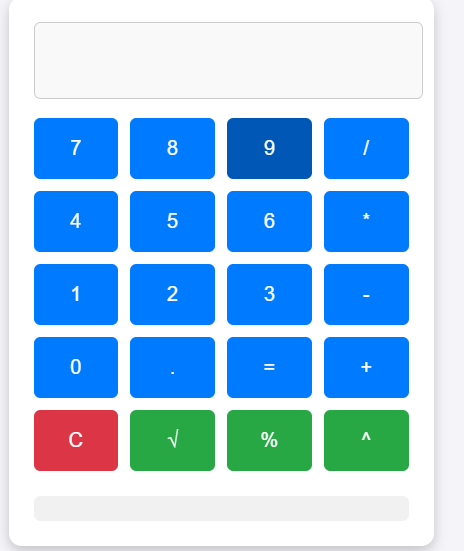

# Advanced Calculator

## Overview
This is a feature-rich calculator implemented using **HTML**, **CSS**, and **JavaScript**. It provides basic arithmetic operations as well as advanced functionalities like square root, percentage calculations, and exponentiation. It also supports keyboard input and maintains a history of calculations.

## Features

- **Basic Operations**: Addition, subtraction, multiplication, and division.
- **Advanced Functions**:
  - Square root (√)
  - Percentage (%)
  - Exponentiation (^)
- **Keyboard Support**: Perform calculations using your keyboard.
- **History Log**: Keeps track of previous calculations.

## Usage

1. Clone or download the repository.
2. Open the `index.html` file in any modern web browser.
3. Use the buttons or your keyboard to perform calculations.

## Keyboard Shortcuts

- Numbers: `0-9`
- Operators: `+`, `-`, `*`, `/`
- Decimal: `.`
- Evaluate: `Enter`
- Clear: `Escape`
- Backspace: `Backspace`

## File Structure

- **index.html**: Contains the structure of the calculator.
- **style.css**: Styles the calculator interface (inline in this project).
- **script.js**: Provides functionality for the calculator (inline in this project).

## Screenshots

## Future Enhancements

- Add scientific functions (e.g., trigonometric, logarithmic operations).
- Support for themes (light/dark mode).
- Mobile responsiveness.

## License

This project is open-source and available under the MIT License.
